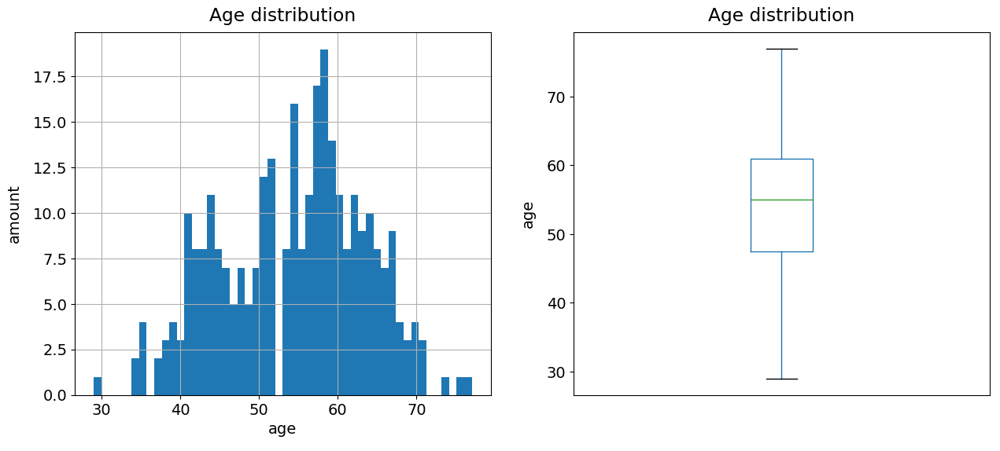

This repository consists of project (in the future there will be more) with random datasheets, which are available online from sources where author allows anyone to use, modify, and distribute the work for any purpose without restrictions.

# 1st project

## Heart study 

Data were obtained from https://www.kaggle.com/datasets/rashikrahmanpritom/heart-attack-analysis-prediction-dataset, 

type of License CC0: Public Domain

This study is only to demonstrate how to work with data using the pandas and matplotlib.pyplot libraries in python. The results of the study have no predictive value. I analyze age distribution, cholestrol, resting blood pressure, etc. of whole datasheet or specific group of people. During analyze I"ve made several partial conclusion, resulting from graphs.

Graph example (more in Jupyter notebook):

Date: 14.01.2024
